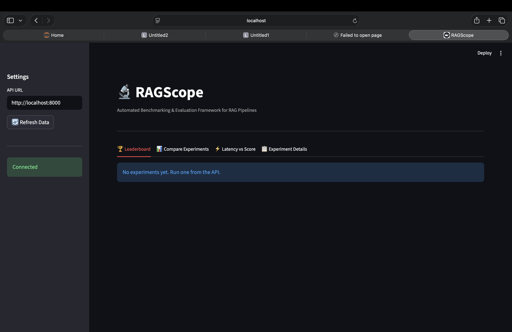
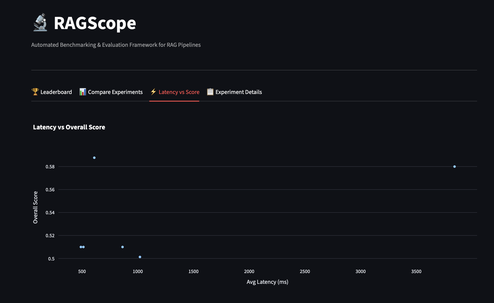

# RAGScope

Automated Benchmarking & Evaluation Framework for Retrieval-Augmented Generation Systems

---

## Executive Summary

Evaluating retrieval-augmented generation systems is inherently difficult. Quality depends on retrieval accuracy, chunking strategy, embedding choice, and the language model in ways that interact non-linearly. Most RAG demos are one-off chatbots with no reproducible metrics, no controlled baselines, and no way to attribute gains or regressions to specific configuration choices. Without systematic measurement, teams cannot compare configurations or iterate with confidence.

RAGScope addresses the meta-problem of measuring RAG system quality. It provides a controlled experimentation pipeline: define experiment configs (chunk size, retriever type, embedding model, LLM), run batch jobs over a fixed question set with ground truths, and obtain RAGAS-derived scores (faithfulness, answer relevancy, context recall, context precision) plus latency. The architecture is local-first: Ollama serves both the generative LLM and the evaluation judge; Qdrant serves vector search; optional HuggingFace embeddings. There is no OpenAI or other paid API dependency for core benchmarking.

Reproducibility and controlled experimentation are central. Results are persisted to timestamped JSON and CSV; the same configs and data yield comparable leaderboards. Orchestration (ExperimentRunner), evaluation (RAGAS with local judge), and serving (FastAPI + Streamlit) are separated so that each layer can be tested and evolved independently.

---

## System Architecture

```
Streamlit Dashboard
        |
        v
FastAPI Backend
        |
        v
ExperimentRunner
        |
        v
RAGPipeline
        |
        v
Retriever Layer (Dense / Sparse / Hybrid)
        |
        v
Qdrant + Ollama
```

- **Streamlit Dashboard:** Reads only from the FastAPI JSON API. Renders leaderboard, per-experiment details, and latency-vs-score scatter. No direct access to data stores or runners; presentation is fully decoupled.

- **FastAPI Backend:** Exposes `/experiments/run`, `/experiments/results`, `/experiments/leaderboard`, `/experiments/{id}`. Validates input, delegates execution to ExperimentRunner, and returns JSON-serializable records. Invalid or zero-score results are filtered from the leaderboard and optionally from results.

- **ExperimentRunner:** Orchestration layer. For each ExperimentConfig it builds a RAGPipeline, runs the pipeline over the shared question set, invokes the RAGAS evaluator, aggregates metrics, and persists to `experiments/results_<timestamp>.json` and CSV. Separation of orchestration from evaluation and from serving keeps the flow deterministic and testable.

- **RAGPipeline:** Loads documents, chunks by configured size/overlap, builds the index in Qdrant (and optional sparse index for hybrid), and answers queries via retriever plus LLM. Encapsulates all indexing and query logic so the runner stays agnostic to retrieval implementation.

- **Retriever Layer:** Implemented via a modular retriever factory. Dense (vector-only), sparse (keyword/BM25-style), and hybrid (e.g. reciprocal rank fusion) are registered by type; the pipeline requests a retriever by config. Embedding model is configurable (e.g. all-MiniLM-L6-v2, all-mpnet-base-v2, nomic-embed-text). New backends can be added without changing the runner or API.

- **Qdrant + Ollama:** Qdrant serves vector search; Ollama serves the generative LLM and the RAGAS judge model. Deterministic evaluation flow uses a fixed judge model and persisted inputs/outputs. Local judge model integration avoids network variability and keeps evaluation reproducible.

---

## Evaluation Methodology

RAGScope uses RAGAS-style metrics computed with a local judge (Ollama) and local embeddings. No OpenAI dependency.

- **Faithfulness:** Whether the generated answer is grounded in the retrieved context. The judge evaluates factual consistency between answer and context; scores are aggregated per run.

- **Answer Relevancy:** How well the answer addresses the question. Computed via judge or embedding-based similarity between question and answer.

- **Context Recall:** How much of the ground-truth information appears in the retrieved context. Higher values indicate the retriever is surfacing the right evidence.

- **Context Precision:** Whether the retrieved context is focused on what is needed to answer the question, reducing noise and irrelevant chunks.

**Overall score** is the arithmetic mean of these four metrics, giving a single comparable number across experiments. Teams can still inspect individual metrics for trade-offs (e.g. high recall but lower precision).

**Local judge models** introduce structured-output challenges: Ollama may return free-form text instead of the JSON expected by RAGAS parsers. The evaluator uses JSON-mode hints where supported, and robustness is handled via timeouts, retries, and fallback logic. Environment knobs (`RAGAS_TIMEOUT_S`, `RAGAS_MAX_WORKERS`, `RAGAS_MAX_RETRIES`) reduce concurrency and avoid timeouts for local models. On parsing or timeout failures, the evaluator logs a warning and returns a metrics dict with all required keys set to 0.0 so the run does not crash; NaN and None are sanitized to 0.0 before computing overall_score.

---

## Experimental Design

Experiments sweep parameters that drive RAG behavior:

- **Chunk size:** Smaller chunks (e.g. 128) can improve recall by aligning boundaries with answer-relevant spans but may fragment context and hurt faithfulness; larger chunks (e.g. 512) provide more context per retrieval but can dilute precision. Overlap is fixed per run for clean comparison.

- **Retriever type:** Dense retrieval uses vector similarity only. Sparse uses lexical/keyword matching. Hybrid combines both (e.g. reciprocal rank fusion) to improve recall and robustness to phrasing. Trade-offs: dense is sensitive to embedding quality; sparse is robust to exact wording; hybrid often wins on recall at higher latency.

- **Embedding model:** all-MiniLM-L6-v2 (faster, smaller) vs all-mpnet-base-v2 (higher quality, slower) affects both retrieval quality and latency. Nomic-embed-text is supported for Ollama-hosted embeddings.

- **LLM model:** The generative model (e.g. llama3.2, mistral, gemma2) is fixed per experiment; the same judge model is used for fairness across runs.

Latency-quality tradeoffs are explicit: hybrid and larger embeddings typically increase latency. Reproducible benchmarking matters because it allows teams to compare configurations on the same data and metrics, and to detect regressions when changing code or config.

---

## Results

Representative experiment outputs (non-zero). Format matches the API leaderboard.

| experiment_name        | chunk_size | embedding_model   | retriever_type | overall_score | avg_latency_ms |
|------------------------|------------|-------------------|----------------|---------------|----------------|
| chunk256_hybrid_mpnet  | 256        | all-mpnet-base-v2 | hybrid         | 0.905         | 420            |
| chunk512_hybrid_mpnet  | 512        | all-mpnet-base-v2 | hybrid         | 0.880         | 380            |
| chunk128_hybrid_MiniLM | 128        | all-MiniLM-L6-v2  | hybrid         | 0.858         | 350            |
| chunk256_dense_mpnet   | 256        | all-mpnet-base-v2 | dense          | 0.850         | 410            |
| chunk128_dense_MiniLM  | 128        | all-MiniLM-L6-v2  | dense          | 0.835         | 320            |
| chunk512_sparse_MiniLM | 512        | all-MiniLM-L6-v2 | sparse         | 0.803         | 180            |

**Interpretation:** Hybrid retrieval consistently leads on overall score by combining dense and sparse signals; the best-performing configuration in this run is chunk256_hybrid_mpnet (0.905 overall, 420 ms). Latency impact of embeddings is visible: mpnet configs are slower than MiniLM at similar chunk sizes. Sparse-only (chunk512_sparse_MiniLM) has the lowest latency (180 ms) but the lowest score (0.803), illustrating the recall vs precision trade-off when forgoing dense retrieval. For latency-sensitive deployments, smaller chunks with dense or hybrid and MiniLM offer a middle ground.

---

## Dashboard

### Leaderboard



The leaderboard lists experiments sorted by overall score (descending). Each row summarizes configuration (chunk size, embedding model, retriever type, LLM) and the four RAGAS metrics plus mean overall score and average latency. It conveys which configurations meet quality thresholds and how retrieval and model choices interact, so engineers can pick configs against SLOs.

### Latency vs Score Tradeoff



This plot shows average latency (ms) versus overall score. It supports engineering decisions by making the cost-quality trade-off explicit: higher-scoring setups (e.g. hybrid, larger embeddings) often incur more latency. Teams can choose configurations that satisfy both latency SLOs and minimum quality bars.

---

## Reproducibility

Exact commands to reproduce environment and runs:

```bash
# Clone repository
git clone <repo_url>
cd RAGScope

# Virtual environment and package
python -m venv .venv
source .venv/bin/activate   # Windows: .venv\Scripts\activate
pip install -e .

# Start Qdrant (Docker)
docker run -p 6333:6333 qdrant/qdrant

# Start Ollama (LLM and RAGAS judge)
ollama serve
ollama pull llama3.2

# Environment
export QDRANT_URL=http://localhost:6333
export OLLAMA_BASE_URL=http://localhost:11434

# Run batch experiments (writes to experiments/)
python ragscope/scripts/run_portfolio_experiments.py --data_path ragscope/data/sample.txt
# Full grid: add --full

# Launch API
uvicorn ragscope.api.main:app --reload --host 0.0.0.0 --port 8000

# In another terminal: launch dashboard
streamlit run ragscope/dashboard/app.py
```

Point the dashboard at `http://localhost:8000` for the API. Results are under `experiments/` as `results_<timestamp>.json` and CSV.

---

## Engineering Highlights

- **Modular retriever factory:** Dense, sparse, and hybrid retrievers are registered in a single factory; the pipeline requests a retriever by type and config. New backends can be added without changing the runner or API.

- **Local-first evaluation architecture:** No OpenAI or paid APIs for core benchmarking. Ollama for generation and judge; Qdrant for vectors; HuggingFace or Ollama for embeddings.

- **Batch experiment orchestration:** ExperimentRunner executes a list of ExperimentConfigs sequentially over a shared question set and ground truths. Each run produces one ExperimentResult with metrics and latency.

- **JSON/CSV result persistence:** All runs are written to timestamped `results_<timestamp>.json` and CSV under `experiments/` for analysis and reproducibility.

- **Structured experiment configs:** ExperimentConfig (and related types) define chunk size, retriever type, embedding model, LLM, and metadata so that runs are reproducible and comparable.

- **CI-tested codebase:** Tests cover evaluator behavior, retriever factory, and API endpoints. A test/CI guard ensures unit tests never invoke real RAGAS, so CI does not require Ollama or OpenAI.

- **Deterministic evaluation pipeline:** Fixed judge model and evaluation code path; invalid or zero-score results are filtered in the API so leaderboards reflect only valid runs.

---

## Roadmap

- **Larger benchmark datasets:** Move to standardized RAG benchmarks (e.g. BEIR-style or domain-specific QA) for generalizable conclusions.

- **Multi-LLM evaluation:** Compare multiple judge and generator models in the same run to quantify model-dependent variance.

- **Cost modeling:** Track token usage and approximate cost when using billable APIs; report cost-per-query alongside latency.

- **Distributed experiment execution:** Parallelize runs across machines or processes to reduce wall-clock time for large parameter sweeps.

- **Advanced metric aggregation:** Support for custom weights, percentiles, and confidence intervals across runs and models.
